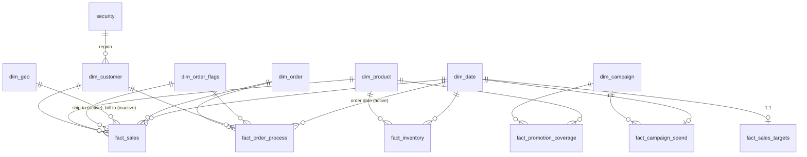

# Sales, Fulfilment & Marketing Data Model (Power BI)

A multi-fact star schema built in Power BI from a raw Excel workbook. This document covers the **data modeling** only: source data, Power Query preparation, the semantic model, relationships, row-level security and DAX calculations.

**Tools:** Power BI Desktop · Power Query (M) · DAX · Excel

## At a glance

| | |
|---|---|
| Source | 1 Excel workbook, 21 sheets |
| Staging queries | 22 (20 from sheets, 1 combined orders query, 1 embedded lookup) |
| Model tables | 7 dimensions, 6 facts, 1 security table, 1 measure table |
| Relationships | 23 (18 active, 5 inactive for role-playing dates and geography) |
| Measures | 39 in 4 display folders |
| Security | Region-based row-level security (RLS) |
| Date range | 1 Jan 2025 to 31 Dec 2026 (730 days) |

## Repository contents

| File | Description |
|---|---|
| `dataset.xlsx` | Raw source data (21 sheets) |
| `data_modeling_project.pbix` | Power BI file containing the queries, model, relationships, RLS and measures |
| `README.md` | This document |

## Source data

The workbook mimics operational systems and is deliberately messy: text keys, placeholder rows, duplicated attributes and wide-format tables.

| Domain | Sheets |
|---|---|
| Customers | `CUST_MASTER`, `customer_contacts`, `user_details`, `Address`, `cities`, `regions` |
| Products | `products`, `subcategories` |
| Orders | `ORDERS_2025`, `ORDERS_2026`, `order_line_items` |
| Fulfilment and payment | `shipments`, `INVOICES`, `invoice_lines`, `payments` |
| Marketing | `CAMPAIGN_LOG`, `campaign_skus` |
| Planning and stock | `sales_targets`, `inventory` |
| Reference and security | `exchange_rates`, `security` |

`channels` is a small lookup table embedded directly in Power Query. `regions`, `exchange_rates` and `invoice_lines` are staged but not yet used by the model.

## Data preparation (Power Query)

Queries follow two layers. All raw sheets sit in a `01_Stage` group with types set and no business logic. The model tables then reference the staging queries, so a source change is fixed in one place.

| Model table | What the query does |
|---|---|
| `dim_customer` | Joins customer master to primary contact email (primary contacts only), credit limit and phone, then street, city and region through address and city lookups. Removes placeholder customer `9999` and technical columns (`hash_key`, `source_id`). |
| `dim_product` | Removes placeholder product code `ZZZ-000` and rows with no brand. Splits the `Category\|Subcategory` text to derive `category`, and adds a `product_key` surrogate key. |
| `dim_geo` | Distinct cities with region and a `geo_key` surrogate key. |
| `dim_order_flags` | Combines `ORDERS_2025` and `ORDERS_2026`, keeps only channel, status and priority, removes duplicates, adds `flag_key` and looks up the channel name. |
| `dim_order` | Distinct order IDs. |
| `dim_campaign` | Distinct campaign attributes (name, channel, dates, budget) from the campaign log, with `campaign_key`. |
| `fact_sales` | One row per order line. Replaces text fields with surrogate keys for customer, product, flag, ship-to city and bill-to city. |
| `fact_order_process` | One row per order. Joins shipments, invoices and payments, then groups to first ship date, last delivery date, invoice date and first and last payment dates. |
| `fact_inventory` | Unpivots monthly columns into product-by-month rows and looks up `product_key`. |
| `fact_campaign_spend` | Daily impressions, clicks and spend per campaign. |
| `fact_promotion_coverage` | Splits the comma-separated promoted SKU list into one row per campaign and product. |
| `fact_sales_targets` | Monthly revenue targets, renamed to the model's naming standard. |
| `security` | User email to region mapping, loaded directly. |

Column names are standardised to `snake_case`.

## Model design



### Table grain

| Table | Grain | Rows |
|---|---|---|
| `fact_sales` | One order line | 200 |
| `fact_order_process` | One order (accumulating snapshot of milestone dates) | 80 |
| `fact_inventory` | Product by month (2025) | 288 |
| `fact_campaign_spend` | Campaign by day | 140 |
| `fact_promotion_coverage` | Campaign by promoted product (bridge) | 30 |
| `fact_sales_targets` | Month | 20 |
| `dim_customer` | Customer | 60 |
| `dim_product` | Product | 60 |
| `dim_geo` | City | 20 |
| `dim_order` | Order | 80 |
| `dim_order_flags` | Channel, status and priority combination | 14 |
| `dim_campaign` | Campaign | 6 |
| `dim_date` | Day (`CALENDARAUTO()`) | 730 |

### Relationships

| From (many side) | To (one side) | Active |
|---|---|---|
| `fact_sales[customer_id]` | `dim_customer[customer_id]` | Yes |
| `fact_sales[product_key]` | `dim_product[product_key]` | Yes |
| `fact_sales[flag_key]` | `dim_order_flags[flag_key]` | Yes |
| `fact_sales[order_id]` | `dim_order[order_id]` | Yes |
| `fact_sales[order_date]` | `dim_date[Date]` | Yes |
| `fact_sales[ship_to_city_key]` | `dim_geo[geo_key]` | Yes |
| `fact_sales[bill_to_city_key]` | `dim_geo[geo_key]` | No |
| `fact_order_process[order_id]` | `dim_order[order_id]` | Yes |
| `fact_order_process[customer_id]` | `dim_customer[customer_id]` | Yes |
| `fact_order_process[flag_key]` | `dim_order_flags[flag_key]` | Yes |
| `fact_order_process[order_date]` | `dim_date[Date]` | Yes |
| `fact_order_process[ship_date]`, `[delivery_date]`, `[invoice_date]`, `[last_pay_date]` | `dim_date[Date]` | No (four relationships) |
| `fact_inventory[product_key]` | `dim_product[product_key]` | Yes |
| `fact_inventory[month]` | `dim_date[Date]` | Yes |
| `fact_campaign_spend[campaign_key]` | `dim_campaign[campaign_key]` | Yes |
| `fact_promotion_coverage[campaign_key]` | `dim_campaign[campaign_key]` | Yes |
| `fact_promotion_coverage[product_key]` | `dim_product[product_key]` | Yes |
| `fact_campaign_spend[date]` | `dim_date[Date]` (one-to-one) | Yes |
| `fact_sales_targets[date]` | `dim_date[Date]` (one-to-one) | Yes |
| `dim_customer[region]` | `security[region]` | Yes |

### Modeling patterns used

- **Star schema with several fact tables.** Sales, order process, inventory, marketing and targets share the conformed dimensions `dim_date`, `dim_product`, `dim_customer` and `dim_order_flags`.
- **Junk dimension.** `dim_order_flags` holds the low-cardinality channel, status and priority combinations, keeping them out of the fact tables.
- **Surrogate keys.** Products, cities, flags and campaigns get integer keys, replacing text joins in the facts.
- **Role-playing dimensions.** `fact_order_process` has five dates against one `dim_date`, and `fact_sales` has two cities against one `dim_geo`. One relationship is active and the rest are inactive, activated in DAX with `USERELATIONSHIP`.
- **Accumulating snapshot.** `fact_order_process` holds one row per order with a column for each lifecycle milestone, which supports cycle-time measures.
- **Bridge table.** `fact_promotion_coverage` resolves the many-to-many relationship between campaigns and products.
- **Thin conformed dimension.** `dim_order` links the order-line and order-process facts at order level.
- **Wide-to-long reshaping.** Monthly inventory columns are unpivoted so the fact table can relate to the date table.

### Row-level security

A role filters `dim_customer` with:

```dax
[region] = LOOKUPVALUE(security[region], security[user_email], USERPRINCIPALNAME())
```

Regional filtering flows to `fact_sales` and `fact_order_process` through their customer relationships. Test it with Modeling > View as.

## DAX calculations

**Calculated columns**

| Column | Definition |
|---|---|
| `fact_order_process[order_to_pay]` | `DATEDIFF(order_date, last_pay_date, DAY)` |
| `dim_date[Year]`, `dim_date[Month]` | `YEAR()` and `MONTH()` of `Date` |

**Measures** live in a dedicated `_measures` table and are organised in display folders.

| Folder | Measures |
|---|---|
| Core (5) | `total_sales`, `total_orders`, `total_active_customers`, `base_total_customers`, `avg_order_to_pay` |
| 1 Sales (11) | `units_sold`, `avg_order_value`, `gross_sales_at_list`, `discount_value`, `discount_pct`, `total_cost`, `gross_margin`, `gross_margin_pct`, `sales_ytd`, `sales_prior_year`, `sales_yoy_pct` |
| 2 Targets (4) | `sales_target`, `target_variance`, `target_attainment_pct`, `target_status` |
| 3 Fulfilment (8) | `orders_tracked`, `avg_order_to_ship_days`, `avg_ship_to_delivery_days`, `avg_order_to_invoice_days`, `avg_invoice_to_pay_days`, `unshipped_orders`, `unpaid_orders`, `unpaid_order_pct` |
| 4 Marketing (11) | `total_spend`, `total_impressions`, `total_clicks`, `ctr_pct`, `cost_per_click`, `cost_per_1000_impressions`, `campaign_budget`, `budget_utilization_pct`, `campaigns_running`, `promoted_product_sales`, `promoted_sales_per_spend` |

Examples:

```dax
gross_margin_pct = DIVIDE([total_sales] - [total_cost], [total_sales])

target_attainment_pct = DIVIDE([total_sales], SUM(fact_sales_targets[target_revenue]))

promoted_product_sales =
SUMX(dim_campaign,
    VAR prods = SELECTCOLUMNS(RELATEDTABLE(fact_promotion_coverage), "k", fact_promotion_coverage[product_key])
    RETURN CALCULATE([total_sales],
        TREATAS(prods, dim_product[product_key]),
        DATESBETWEEN(dim_date[Date], dim_campaign[start_date], dim_campaign[end_date])))
```

## Data quality notes and limitations

- **Name-based joins.** Product, customer and city keys are matched on text names in Power Query. Duplicate or misspelled names would misattribute rows. Three sales lines (688 in sales) have no matching product.
- **Index-based surrogate keys.** Keys are generated by row order after de-duplication, so they can change if the source order changes.
- **Discounts.** `discount_percentage` is present on 99 lines (up to 15%), but `line_total` equals quantity times unit price. Whether `total_sales` is before or after discount needs confirming with the data owner.
- **Future-dated orders.** Ten sales lines fall in October 2026, after the data snapshot date.
- **One-to-one date relationships.** Campaign spend and sales targets relate one-to-one to `dim_date`. This holds while there is one row per date, and it would break if two campaigns spent on the same day.
- **RLS coverage.** The role filters customers only, so inventory, campaign spend and targets are not restricted by region.
- **Promoted product sales** shows association between promoted products and sales in campaign windows, not proven attribution. Overlapping campaigns can double count.

## Opening the model

1. Open `data_modeling_project.pbix` in Power BI Desktop.
2. The queries point to the original file location. Go to Transform data > Data source settings > Change Source and select your local copy of `dataset.xlsx`.
3. If refresh fails with a privacy firewall error (`Formula.Firewall`), go to File > Options > Current File > Privacy and choose "Ignore the Privacy Levels".
4. Open Model view to see the relationships, and Modeling > View as to test row-level security.
